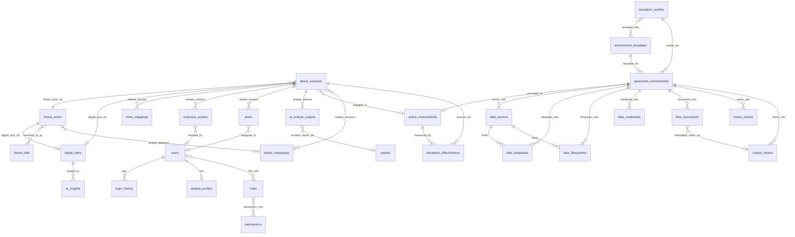

# 03 · Relationship Diagram

Entity relationships across the 28 collections. Relationships are by **business
key** (string) unless noted; cardinality reflects the embed/reference policy in
`01_architecture_overview.md`.

## Key relationship notes

| Relationship | Type | Why |
|--------------|------|-----|
| `attack_sessions → threat_actors` | reference | actors are shared across many sessions and queried independently |
| session child arrays (`commands/files/creds/timeline`) | embed | bounded, owned, read with the session |
| `threat_actors ↔ digital_twins` | 1:1 reference | a twin is the analytic model of one actor; unique `attacker_id` index |
| `generated_environments → fake_*` | reference arrays | components are large and independently lifecycle-managed |
| `roles ↔ permissions`, `users ↔ roles` | many-to-many reference | RBAC resolution at auth time |
| `mitre_mappings → attack_sessions` | reference (1 session : many mappings) | techniques queried by id across sessions |
