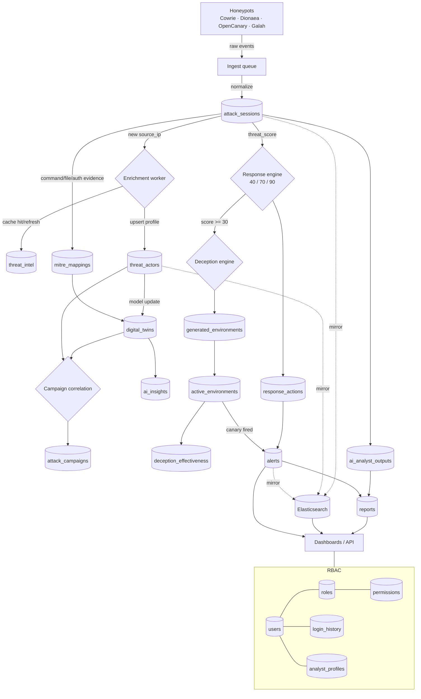

# 04 · Data Flow

End-to-end flow: **ingest → enrich → correlate → respond → report**, with the
collection written at each step.

## Step-by-step

1. **Ingest** — honeypot events are normalized into `attack_sessions` (status `active`).
2. **Enrich** — first sighting of a `source_ip` triggers the enrichment worker:
   `threat_intel` cache is read/refreshed and the `threat_actors` profile is upserted.
3. **Map** — command/file/auth evidence is matched to ATT&CK → `mitre_mappings`.
4. **Model** — `digital_twins` updates the actor's behavioural fingerprint;
   correlation produces `attack_campaigns` and predictive `ai_insights`.
5. **Respond** — the response engine reads the session `threat_score` and writes a
   `response_actions` decision (matrix 40/70/90); ≥30 also spins up a
   `generated_environments` → `active_environments` deception instance, scored in
   `deception_effectiveness`.
6. **Alert & report** — `alerts` fire (with delivery tracking); `ai_analyst_outputs`
   produce narratives feeding `reports`.
7. **Serve** — dashboards read MongoDB + the Elasticsearch mirror of hot collections.
