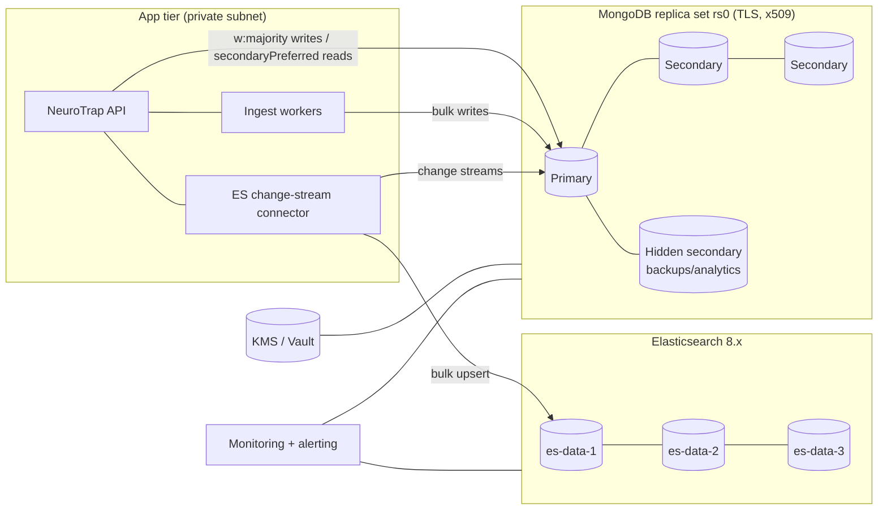

# 11 · Production Deployment

## 1. Topology

- **Replica set** `rs0`: 3 data-bearing voting nodes + 1 hidden non-voting node for
  backups/heavy analytics. Across ≥ 3 availability zones.
- Shard later by promoting to a sharded cluster (config servers + mongos) when
  `attack_sessions` write volume demands it (doc 07).

## 2. Node sizing (starting point for thousands of sessions/day)

| Component | vCPU | RAM | Disk | Notes |
|-----------|------|-----|------|-------|
| mongod (each voting node) | 8 | 32 GB | 500 GB NVMe (gp3/io2) | RAM ≥ working set + indexes |
| mongod hidden node | 4 | 16 GB | 1 TB | backups + analytics, can lag |
| ES data node (×3) | 8 | 32 GB (16 GB heap) | 1 TB SSD | ILM hot/warm |
| API / workers | 4 | 8 GB | — | horizontally scaled behind LB |

## 3. Monitoring

- **Metrics:** MongoDB Exporter → Prometheus → Grafana. Watch: opcounters, repl
  lag, page faults / WiredTiger cache hit, connections, queue depth, oplog window,
  chunk balance.
- **Alerts:** primary election/step-down, replication lag > 10 s, oplog window
  < 1 h, disk > 75 %, connection saturation, TTL backlog, ES bulk-reject rate.
- **Logs:** ship `mongod` + audit logs to the SIEM; the connector exposes
  lag/resume-token health.

## 4. Hardening checklist

- [ ] `requireTLS`, x509 cluster auth, no plaintext listeners
- [ ] Bound to private subnets; security groups restrict to app tier only
- [ ] SCRAM/x509 auth enabled; root account unused by apps; per-service least-priv users
- [ ] Encryption at rest (KMS) + CSFLE on credential/PII fields
- [ ] `$jsonSchema` validators deployed (`init_db.js`), `validationAction: error` on hot collections
- [ ] Auditing enabled; change-stream audit sink running
- [ ] Server-side JS disabled unless required
- [ ] Backups configured + last restore drill green (doc 09)
- [ ] Index build reviewed; no missing index on dashboard queries (doc 05)
- [ ] Balancer healthy / pre-split before known scan events (when sharded)
- [ ] Monitoring + paging wired; runbook linked

## 5. Rollout

1. Provision replica set, KMS, TLS certs.
2. Run `scripts/init_db.js` to create collections, validators, indexes.
3. Seed reference data (`roles`, `permissions`, `environment_templates`, `deception_profiles`).
4. Start ingest workers + API with least-priv DB users.
5. Start ES + connector; backfill hot indices.
6. Verify dashboards, alerting, and a restore drill before go-live.
