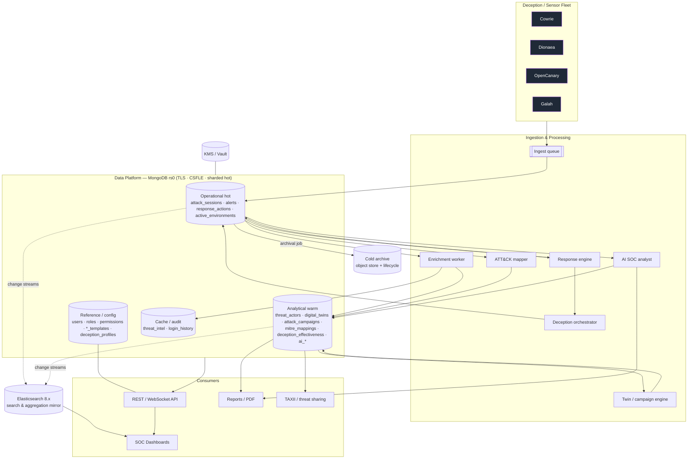

# 12 · Final Architecture Diagram

Enterprise view tying the sensor fleet, data platform, processing, and consumers
together.

## Layer summary

| Layer | Role | Key collections |
|-------|------|-----------------|
| Sensors | Capture attacker telemetry | — (write to `attack_sessions`) |
| Ingestion & processing | Normalize, enrich, map, model, respond, deceive, explain | all writers |
| Data platform | System of record (MongoDB rs0), tiered hot/warm/ref/cache | 28 collections |
| Search mirror | Free-text + aggregation | Elasticsearch (doc 10) |
| Cold archive | Long-term raw retention | object store (doc 08) |
| Security plane | Keys, RBAC, audit | KMS, `users`/`roles`/`permissions`, `login_history` |
| Consumers | Dashboards, API, reports, sharing | reads from Mongo + ES |

This is the target enterprise topology; the single-replica-set + ES + connector
deployment in doc 11 is the concrete starting build that realizes it.
